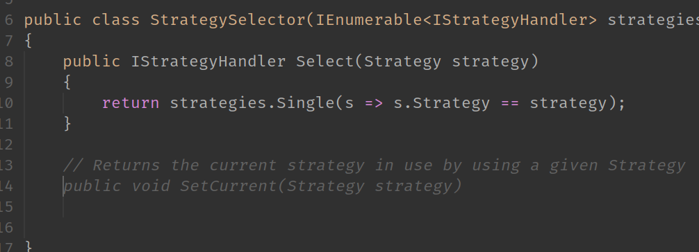

# pixxel-nvim
My personal Neovim configuration, primarly focused on dotnet web dev

# Installation Requirements:

## Env Variables to enable

```
export NIX_ENABLE_DOTNET=1
export NIX_ENABLE_RUST=1
export NIX_ENABLE_LUA=1
export NIX_ENABLE_COPILOT=1
```

Each toggles on/off the behaviors for neovim, to reduce unnecessary plugins being installed/loaded

### Requires Nightly latest neovim (pre-release)
Last tested working on `v0.11.1`

https://github.com/neovim/neovim/releases

### NerdFonts
Requires you to have a Nerdfont installed, and your terminal configured to use it
https://www.nerdfonts.com/font-downloads

### Treesitter: Chocolate + c/cpp Make
#### Chocolate
https://chocolatey.org/
#### c/cpp
```
choco install mingw
choco install llvm
```
### Telescope grep: ripgrep
#### ripgrep
https://github.com/BurntSushi/ripgrep?tab=readme-ov-file#installation


## Dotnet/C# support

### netcoredbg
https://github.com/Samsung/netcoredbg/releases
Same as omnisharp, once downloaded and installed, must be added to PATH
Can validate it works via executing `netcoredbg --version` in your terminal

Also, and very importantly, I have a configuration setup to remote debug with netcoredbg **over ssh targeting windows**, for more info see below

### Roslyn LSP (C#, .NET)
1. Download the latest copy of `Microsoft.CodeAnalysis.LanguageServer`

* Linux x64: https://dev.azure.com/azure-public/vside/_artifacts/feed/vs-impl/NuGet/Microsoft.CodeAnalysis.LanguageServer.linux-x64

* Windows x64: https://dev.azure.com/azure-public/vside/_artifacts/feed/vs-impl/NuGet/Microsoft.CodeAnalysis.LanguageServer.win-x64

(Note other architectures are supported but I just linked the two most obvious ones)

2. It will be a .nupkg file, just rename it to a .zip and unzip it.

3. You will find the actual LSP folder at `./content/LanguageServer/<YourArch>/` in the zip

4. Copy that folder to the following:

* Linux: `/usr/local/lib/roslyn/`

* Windows: `C:\Program Files\Roslyn\` 

(Note that the file `Microsoft.CodeAnalysis.LanguageServer.dll` should exist in this directory if you did it right, IE the file `/usr/local/lib/roslyn/Microsoft.CodeAnalysis.LanguageServer.dll` should exist now)

## Typescript / Json
### ts_ls LSP
`npm install -g typescript typescript-language-server`

## Lua

### lua-language-server LSP
https://github.com/LuaLS/lua-language-server/releases/latest

#### .editorconfig
Here is my recommended .editorconfig file to go in `~`
```
root = true

[*.{cs,vb}]
csharp_style_namespace_declarations = file_scoped
csharp_style_var_for_built_in_types = true
csharp_style_var_when_type_is_apparent = true
csharp_style_var_elsewhere = true
dotnet_style_prefer_conditional_expression_over_return = false
```

# How to install this configuration
## Windows
nvim folder location should be `%LocalAppData%/nvim`, checkout the git repo to that location with that name.
If done correctly the file `%LocalAppData%/nvim/README.md` should exist.

## Linux
nvim folder location should be `~/.config/nvim`, checkout the git repo to that location with that name.
If done correctly the file `~/.config/nvim/README.md` should exist.


# Connect to an already running process

If you want something a bit faster and more ad-hoc, you can just use the "Build and Run" shortcut instead and select "Connect to a process", it'll then give you a fuzzy searchab;e process list to pick from and connect to.

To be honest this has now started to become my preferred approach, once you know what to search for it becomes pretty fast to quickly connect.

# List of major plugins included in this setup and a quick blurb about them, and relevant keybinds for them
## [nvim-dap](https://github.com/mfussenegger/nvim-dap) + [nvim-dap-ui](https://github.com/rcarriga/nvim-dap-ui)
Debugger and interface. Currently just setup with `netcoredbg` to debug dotnet applications

- [ ] TODO: Add node/npm support for web dev

`F9` - Toggle Breakpoint  
`F5` - Build and run  

All other keybinds are largely the same

## [lsp-config](https://github.com/neovim/nvim-lspconfig) + [cmp](https://github.com/hrsh7th/nvim-cmp)
Autocomplete/code suggestions/etc

Currently using the following LSPs:
* Dotnet: Roslyn
* html: vscode-langservers-extracted
* TS/JS/Node/NPM/Json: typescript-language-server
* Lua: lua_ls
- [ ] TODO: Figure out the best LSP for CSS/SASS/SCSS  

## [lualine](https://github.com/nvim-lualine/lualine.nvim)
Adds a nice status line at the bottom of the editor with tonnes of meta info like git, line ending type, character format, filetype, line number and char pos, etc etc.

## [nvim-comment](https://github.com/terrortylor/nvim-comment)
Toggling code comments on/off

`Ctrl + /` - Comments out a selected block of lines, if you have a block selected  
`Ctrl + / Ctrl + /` - Comments out the current line the cursor is on, if no selection is made  

## [gitsigns](https://github.com/lewis6991/gitsigns.nvim)
Git integration for multiple other plugins, primarily used to show del/add/modify status of files, folders, individual lines of code, etc

## [nvim-tree](https://github.com/nvim-tree/nvim-tree.lua) 
VSCode style File browser on lefthand side + tabs on the top. nvim-tree supports a bunch of commands for adding/removing/changing files and directories

## [harpoon](https://github.com/ThePrimeagen/harpoon/tree/harpoon2)
Navigation tool for quickly "remembering" the last place you were in a buffer when you change buffers, providing a "history" style functionality to quickly hop back to the last place you were in the prior buffer. Has "hot" memory for quick swapping between 4 buffers

## [nvim-scrollbar](https://github.com/petertriho/nvim-scrollbar)
Pretty but minimalist scrollbar on buffers. Has both `lsp-config` integration to show potential code warnings/errors/suggestions, as well as git integration to show status of individual lines

## [nvim-treesitter](https://github.com/nvim-treesitter/nvim-treesitter)
Mandatory treesitter as every vim config has. Code highlighting / coloring / etc. You'd be a madlad to not have this plugin

## [nvim-telescope](https://github.com/nvim-telescope/telescope.nvim)
Another mandatory plugin everyone uses. Searching, Grepping, but also a handy tool for pickers and floating selectors and whatnot, many other plugins depend on this

## [telescope-ui-select](https://github.com/nvim-telescope/telescope-ui-select.nvim)
Replaces vim's default select picker with above aformentioned telescope's much fancier and prettier picker, which includes filtering options by text input

## git-conflict
Handy tool for detecting git conflict `>...` + `..<` in files. Disables code suggestions until git conflicts are resolved, and enables a handful of handy commands for resolving conflicts and navigating them.

## [lsp-overloads](https://github.com/Issafalcon/lsp-overloads.nvim)
Extremely handy plugin for toggling visibility of the signature of methods, as well as browsing the method's overloads
#### keybinds
`ctrl-s` - Force show overloads popup, for the method currently selected in the buffer  
`alt-s` - Hide the overloads popup  
`ctrl-h/l` - browse the paramaters and their definitions of the current signature  
`ctrl-j/k` - browse the list of overloads  
# Keybinds

Keybinds are setup (aside from the handful that need to work in insert mode) to follow three steps to their chords.
1. `<leader>`, which is by default set to be Spacebar
2. Category key, which is a key for each category of commands.
3. Command key, which is the final key for the actual command itself.

For example, for the command "Format" below, the chord would be: 
* `<Spacebar>rf` for Leader -> [R]efactor -> [F]ormat

## [C]onsole
### (Normal Mode) [E]xecute current line
### (Visual Mode) [E]xecute current selection
For both of the above, requires tmux to be installed and neovim to be running inside a tmux session.

Will open up a new tmux panel (if one hasnt been opened yet) and pipe the current line (normal mode) or selected text (visual mode) into the tmux panel, executing it.

### [O]pen console
Opens up a quick ad-hoc inline console window. Enter into [i]nsert mode to type into it.

## [D]ebug
This section deals with all keybinds for interacting with the debugger
### Toggle [B]reakpoint
Toggles a breakpoint being set on the given line for nvim-dap debugger

### [C]lear Breakpoints
Clears all stored breakpoints in the current session for nvim-dap debugger

### [L]ist Breakpoints
Opens up a Telescope Picker for all existing breakpoints

### Build and [R]un
Starts nvim-dap, running the debugger for given configurations

## [F]iles
This section deals with all navigation to change files/buffers
### Search Current [B]uffers
Opens a Telescope Picker for all currently opened buffers

### Search [C]hanged Files
Opens a Telescope file picker, pulled from git history to list all modified files both from uncommitted changes, stashed changes, and unpushed changes

### Search [G]it Files
Opens a Telescope file picker for all files except for those ignored by .gitignore

### Search File [H]istory
Opens a Telescope file picker based on recently opened files in all neovim sessions

### Search files by g[r]ep
Opens a Grep fuzzy finder, that will find files with text that matches the grep fuzzy find.

## [G]it
This section deals with all registered hotkeys to help with git functionality

### [S]witch branches
Opens a Telescope picker to switch Git branches

### (Conflict) [H] - Prev conflict
Jumps to the previous detected merge conflict in the buffer

### (Conflict) [L] - Next conflict
Jumps to the next detected merge conflict in the buffer

### (Conflict) List [C]onflicts
Opens up a list of navigable detected merge conflicts in the buffer

### (Conflict) Choose [N]one
Chooses neither of the options for a merge conflict

### (Conflict) Choose [Y]ours
Chooses Your (Local/Current) changes in the merge conflict (Option A)

### (Conflict) Choose [T]heirs
Chooses Their (Remote/Incoming) changes in the merge conflict (Option B)

### (Conflict) choose [B]oth
Chooses both Local + Remote changes in the merge conflict (Options A+B)

## [R]efactor
All keybinds related to modifying the buffer

### [A]ction Menu
Opens up the LSP's Action Menu at the given cursor

### [F]ormat
Formats the buffer's code

### [R]ename
Opens a prompt to rename the selected symbol (most LSPs will propogate this rename across all files, mileage will vary)

### [U]ndo History
Brings up a Telescope picker for all Undo history, including with a diff display for the changes! Uses the following default keybinds:

* `<CR>` - Yanks the specific discrete `++` changes into default register
* `<S-CR>` - Yanks the specific discrete `--` changes into default register
* `<C-CR>` - Reverts the buffer back to the selected point in History

## [S]earch
Handles keybinds involved in navigating based on the current buffer

### [D]efinitions
Opens a telescope picker to show all definitions of selected symbol. Will jump straight to the definition if only one exists.

### [F]ind
Opens up a fuzzy Grep for within the current buffer

### [I]mplementations
Opens up a telescope list for Implementations of the selected symbol. Will jump directly to the result if only one exists.

### [R]eferences
Opens up a telescope picker for all references of the selected symbol

### [S]ymbols
Opens up a telescope picker showing for declared symbols in the current buffer

### Diagnostic [W]arnings
Opens up a telescope picker for all diagnostic warnings of the current buffer

## [L]LM
Category for all keybinds regarding LLM/Copilot chat interactions

### [T]oggle Copilot chat
Toggles the Copilot chat window open/closed

### [S]top Copilot chat output
Stops the current Copilot chat response generation

### View [P]rompt templates
Opens a picker to view and select from available Copilot chat prompt templates (available in both normal and visual mode)

### [E]xplain current selection
Asks Copilot to explain the current selection or context (available in both normal and visual mode)

### [R]eview current selection
Asks Copilot to review the current selection or context (available in both normal and visual mode)

### Pick [F]iles for chat context
Opens a file picker to select multiple files to add as context to the Copilot chat

### Fi[X] current selection
Asks Copilot to fix issues in the current selection or context (available in both normal and visual mode)

### [O]ptimize current selection
Asks Copilot to optimize the current selection or context (available in both normal and visual mode)

### [D]ocument current selection
Asks Copilot to generate documentation for the current selection or context (available in both normal and visual mode)

## [T]ests

# Examples
### Editting

### LSP Integration and suggestions

### Dap UI running interactive debugger

### Locally hosted LLM integration

