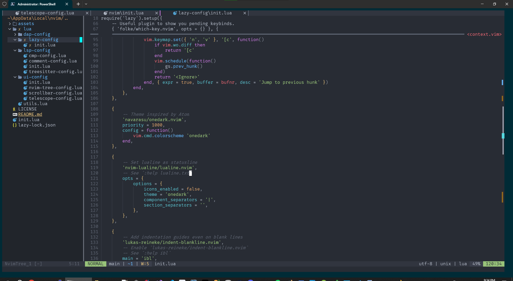
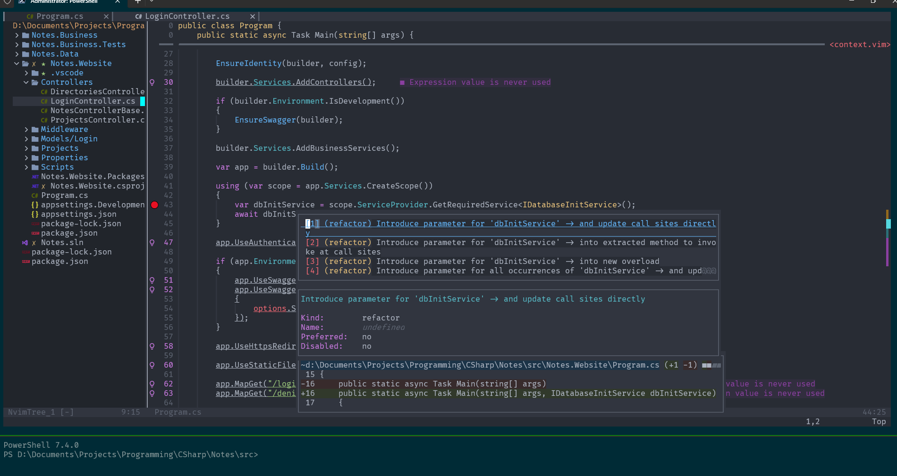
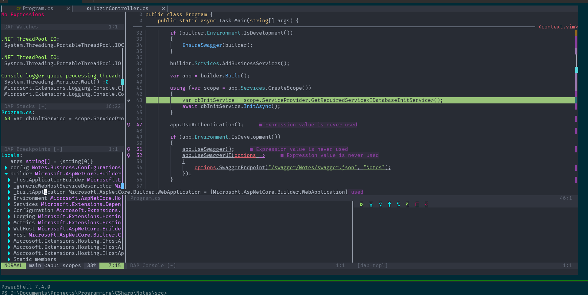

# pixxel-nvim
My personal Neovim configuration, primarly focused on dotnet web dev

# Installation Requirements:

### Requires Nightly latest neovim (pre-release)
Last tested working on `v0.10.0-dev-*`

https://github.com/neovim/neovim/releases

### NerdFonts
Requires you to have a Nerdfont installed, and your terminal configured to use it
https://www.nerdfonts.com/font-downloads

### Treesitter: Chocolate + c/cpp Make
#### Chocolate
https://chocolatey.org/
#### c/cpp
```
choco install mingw
choco install llvm
```
### netcoredbg
https://github.com/Samsung/netcoredbg/releases
Same as omnisharp, once downloaded and installed, must be added to PATH
Can validate it works via executing `netcoredbg --version` in your terminal

### Roslyn LSP
https://github.com/jmederosalvarado/roslyn.nvim

After nvim finishes installing packages, you will need to execute `:CSInstallRoslyn`, at which point the package will download the latest Roslyn package and automatically install it

### html LSP
`npm i -g vscode-langservers-extracted`

### tsserver LSP
`npm install -g typescript typescript-language-server`

# How to install this configuration (Windows)
nvim folder location should be `%LocalAppData%/nvim`, checkout the git repo to that location with that name.
If done correctly the file `%LocalAppData%/nvim/README.md` should exist.

# Supports Build and Run for dotnet projects

First you must have a launch.json configured in your project root. proj-loader will automatically detect the path `.vs/launch.json` in the root of your project, and it assumes the project root based off the presence of a greedy depth first search of a .csproj file.

Example `launch.json` file:
```
{
    "version": "0.2.0",
    "configurations": [
        {
            "type": "cs",
            "name": "netcoredbg",
            "request": "launch",
            "program": "Your.Project.Name.dll",
            "cwd": "${workspaceFolder}/bin/Debug/net8.0/"
        }
    ]

}
```

proj-loader is configured by to use the found project root (where your .csproj file is) as its relative cwd for the launch.json, so you very likely willl always want your `cwd` entry to be similiar to the one above.

- [ ] TODO: Add support for changing build configs with proj-loader via a User Command

# List of major plugins included in this setup and a quick blurb about them, and relevant keybinds for them
## [nvim-dap](https://github.com/mfussenegger/nvim-dap) + [nvim-dap-ui](https://github.com/rcarriga/nvim-dap-ui)
Debugger and interface. Currently just setup with `netcoredbg` to debug dotnet applications

- [ ] TODO: Add node/npm support for web dev

`F9` - Toggle Breakpoint  
`F5` - Build and run  

All other keybinds are largely the same

## [lsp-config](https://github.com/neovim/nvim-lspconfig) + [cmp](https://github.com/hrsh7th/nvim-cmp)
Autocomplete/code suggestions/etc

Currently using the following LSPs:
* Dotnet: Omnisharp
* html: vscode-langservers-extracted
* TS/JS/Node/NPM/Json: typescript-language-server
* Lua: lua_ls
- [ ] TODO: Figure out the best LSP for CSS/SASS/SCSS  

`F12` - Usages  
`Ctrl+F12` - Implementations  
`gd` - Jump to definition  
`Alt+Enter` - Code Actions/Suggestions  
`shift+K` - Documentation  
`Ctrl+K Ctrl+F` - Format/Lint Document  

## [Comment.nvim](https://github.com/numToStr/Comment.nvim)
Toggling code comments on/off

`Ctrl + /` - Comments out a selected block of lines, if you have a block selected  
`Ctrl + / Ctrl + /` - Comments out the current line the cursor is on, if no selection is made  

## [gitsigns](https://github.com/lewis6991/gitsigns.nvim)
Git integration for multiple other plugins, primarily used to show del/add/modify status of files, folders, individual lines of code, etc

## [nvim-tree](https://github.com/nvim-tree/nvim-tree.lua) + [barbecue](https://github.com/utilyre/barbecue.nvim)
VSCode style File browser on lefthand side + tabs on the top. nvim-tree supports a bunch of commands for adding/removing/changing files and directories

- [ ] TODO: Figure out how to fix the fact that barbecue breaks if you open a directory directly with nvim initially, despite the fact that nvim-tree works fine in this scenario

## [nvim-scrollbar](https://github.com/petertriho/nvim-scrollbar)
Pretty but minimalist scrollbar on buffers. Has both `lsp-config` integration to show potential code warnings/errors/suggestions, as well as git integration to show status of individual lines

- [ ] TODO: Modify the icons and highlighting to make more sense and be less messy. We have nerdfont capability and can definitely improve the UX here

## [nvim-treesitter](https://github.com/nvim-treesitter/nvim-treesitter)
Mandatory treesitter as every vim config has. Code highlighting / coloring / etc. You'd be a madlad to not have this plugin

## [nvim-telescope](https://github.com/nvim-telescope/telescope.nvim)
Another mandatory plugin everyone uses. Searching, Grepping, but also a handy tool for pickers and floating selectors and whatnot, many other plugins depend on this

'?' - Find recently opened files  
'/' - Fuzzy search current buffer  
`  `(space space) - List buffers  
`gf` - search git files  
`sf` - search files  
`sh` - search help  
`sw` - search current word (handy for finding chars in giant strings)  
`sg` - grep  
`sG` - grep entire workspace  
`sd` - search diagnostics  
`sr` - Resume search  

## [telescope-ui-select](https://github.com/nvim-telescope/telescope-ui-select.nvim)
Replaces vim's default select picker with above aformentioned telescope's much fancier and prettier picker, which includes filtering options by text input

## [new-file-template](https://github.com/SteffenBlake/new-file-template.nvim) (custom fork)
Templating for new files created if they match specific filename matches. Custom fork of the original plugin that switches the API to a callback system to support pickers/inputs with callback patterns

#### cs
Prompts for templates for the following currently supported types:
* class
* struct
* enum
* interface
#### lua
Defaults, built in
#### Ruby
Defaults, built in, I dunno how these work tbh they came with the plugin and I dont use ruby so /shrug
#### Javascript
WIP, TODO
#### Typescript
WIP, TODO

## [lsp-overloads](https://github.com/Issafalcon/lsp-overloads.nvim)
Extremely handy plugin for toggling visibility of the signature of methods, as well as browsing the method's overloads
#### keybinds
`ctrl-s` - Force show overloads popup, for the method currently selected in the buffer
`alt-s` - Hide the overloads popup
`ctrl-h/l` - browse the paramaters and their definitions of the current signature
`ctrl-j/k` - browse the list of overloads

## [Neorg](https://github.com/nvim-neorg/neorg)
Pretty powerful and handy note taking, journal, calender, to-do list, etc AIO for neovim. Lets you designate predifined "workspace" folders your notes/journals etc get saved in.
My preferred use case is journal+todo lists to have tracked to-do items day by day for work.

There's a solid youtube series on how to use it here:
https://www.youtube.com/watch?v=NnmRVY22Lq8

Keybinds:
WIP

Default workspace config:
* Notes: `~/Documents/notes/` (default workspace)
* Journal: `~/Documents/journal/`(default journal workspace)
Note: the above folders will need to exist prior to using any of the Neorg commands, or you'll get some errors

# Examples
### Editting

### LSP Integration and suggestions

### Dap UI running interactive debugger

